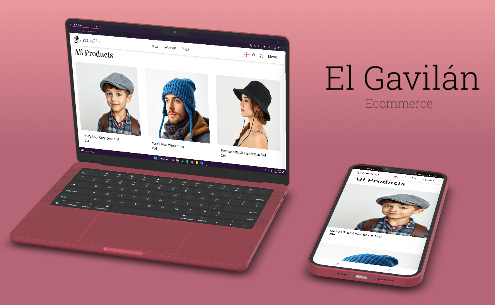

# El Gavilán | Ecommerce



## Table of contents

- [Description](#description)
- [Features](#features)
- [Tech Stack](#tech-stack)
- [Installation](#installation)
- [Usage](#usage)
- [Testing](#testing)
- [Future Improvements](#future-improvements)
- [Deployment](#deployment)

## Description

**El Gavilán** is a traditional hat shop based in Alicante, established in 1970. This digital platform aims to enhance the shop's online presence and sales by offering a seamless shopping experience. Built with **Next.js**, **React**, **TypeScript**, and **Tailwind CSS**, it ensures a modern and efficient interface for customers to browse, filter, and purchase products.

## Features

- 🍭 **Product Listings**: Browse a variety of hats for men, women, and children.
- 🔍 **Search & Filtering**: Easily find the perfect hat.
- 🛒 **Shopping Cart & Checkout**: Secure and smooth checkout process with Stripe integration.
- 👤 **User Authentication**: Secure login & signup system with Supabase.
- 🎨 **Dark Mode**: Toggle between light and dark themes.
- 🛠 **Admin Dashboard**: Manage products, orders, and users.
- 💡 **Localization**: Multi-language support for broader accessibility.
- 🍿 **Product Carousels**: Enhanced product visuals using Swiper.

## Tech Stack

- **Framework**: Next.js (15.1.7)
- **UI Library**: React (19.0.0)
- **Styling**: Tailwind CSS
- **State Management**: Zustand
- **Authentication**: Supabase
- **Payment Processing**: Stripe
- **Icons**: React Icons
- **Image Carousels**: Swiper

## Installation

### Prerequisites

- Node.js (v16+ recommended)
- npm or yarn

### Steps

1. Clone the repository:
   ```bash
   git clone https://github.com/dracudev/gavilan-shop.git
   cd gavilan-shop
   ```
2. Install dependencies:
   ```bash
   npm install
   # or
   yarn install
   ```
3. Set up environment variables. Create a `.env.local` file and add the necessary variables for Supabase and Stripe.
4. Start the development server:
   ```bash
   npm run dev
   # or
   yarn dev
   ```
5. Open `http://localhost:3000` in your browser.

## Usage

- Browse products and use filters to find items.
- Add products to the cart and proceed to checkout.
- Manage user accounts and orders.
- Admins can add, update, or remove products through the dashboard.

## Testing

Automated tests are implemented using Jest and React Testing Library.

To run the tests, use the following command:

```bash
npm test
# or
yarn test
```

## Future Improvements

- Implement end-to-end testing with Cypress.
- Enhance accessibility features.
- Introduce AI-powered assistant.
- Enable user reviews and ratings.
- Expand product categories and filtering options.
- Add more advanced analytics for admin insights.
- Optimize performance for better mobile experiences.

## Deployment

The project is ready for deployment and accesible on: **[Live Demo](https://gavilan-shop.vercel.app)**

---

For any inquiries, reach out at **contact@gavilanshop.com**.

This project is licensed under the [MIT License](LICENSE).
