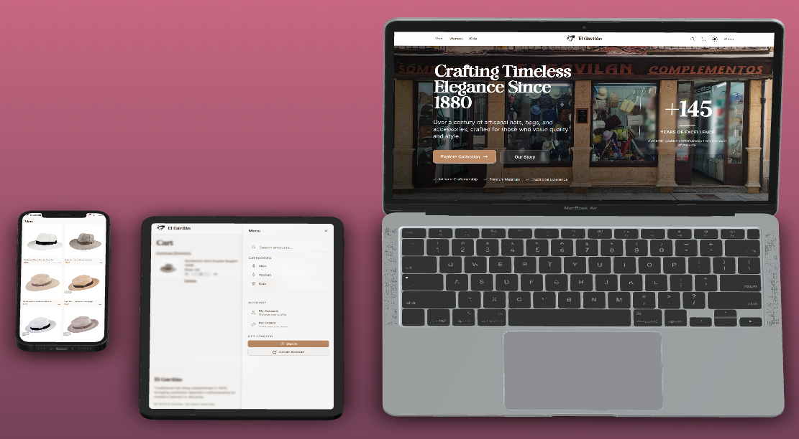

# El Gavilán | E-commerce Platform



> A modern e-commerce platform for a traditional hat shop established in 1880, blending heritage with contemporary digital experiences.

[](https://gavilan-shop.vercel.app)
[](https://creativecommons.org/licenses/by-nc/4.0/)

## Table of Contents

- [About](#about)
- [Features](#features)
- [Tech Stack](#tech-stack)
- [Architecture](#architecture)
- [Design System](#design-system)
- [Progressive Web App](#progressive-web-app)
- [Roadmap](#roadmap)

## About

This project represents the digital transformation of a traditional hat shop from Alicante, Spain, with over 145 years of craftsmanship heritage. This e-commerce platform seamlessly blends traditional elegance with cutting-edge web technologies, providing customers with an intuitive shopping experience while maintaining the shop's authentic brand identity.

## Features

- **Product Catalog** - Advanced filtering, search, and browsing with image carousels
- **Shopping Cart & Checkout** - Persistent cart with secure Stripe payment processing
- **User Authentication** - Supabase Auth with role-based access (customer/admin)
- **Responsive Design** - Mobile-first with dark/light mode switching
- **Admin Dashboard** - Complete product, order, and user management
- **Progressive Web App** - Offline functionality and native app experience
- **Real-time Updates** - Live cart updates and order tracking
- **Security** - SSL encryption, GDPR compliance, and data protection

## Tech Stack

### **Frontend**

- Next.js 15.2.4
- React 19.0.0
- TypeScript 5
- Tailwind CSS 3.4.1

### **Backend & Database**

- Supabase
- Supabase Auth
- Stripe

### **State Management & UI**

- Zustand 5.0.3
- React Icons 5.4.0
- Swiper 11.2.3
- Framer Motion 12.23.12
- clsx

### **Development & Testing**

- Jest 29.7.0
- React Testing Library
- ESLint

### **Build & Deployment**

- Turbopack
- Webpack 5
- PostCSS
- next-pwa
- Vercel

## Architecture

### **Project Structure**

```tree
gavilan-shop/
├── src/
│   ├── app/                    # Next.js App Router
│   │   ├── (locale)/          # Localized routes
│   │   ├── api/               # API routes
│   │   └── globals.css        # Global styles & CSS variables
│   ├── components/            # React components
│   │   ├── product/          # Product-specific components
│   │   ├── products/         # Product listing components
│   │   └── ui/               # Reusable UI components
│   ├── services/             # External service integrations
│   │   ├── supabase/         # Database & auth services
│   │   └── stripe/           # Payment processing
│   ├── store/                # Zustand state management
│   ├── hooks/                # Custom React hooks
│   ├── interfaces/           # TypeScript type definitions
│   ├── utils/                # Utility functions
│   └── middleware.ts         # Route protection & auth
├── public/                   # Static assets
```

## Design System

### **Color**

- **Primary** (#bb8a64): Warm leather tones for brand actions
- **Secondary** (#829ab5): Blue-gray for supporting elements  
- **Accent** (#8b2635): Burgundy for call-to-actions
- **Extended**: 50 variants per color (50-900) plus semantic states

### **Typography**

- **Brand Font** (Glorius): Custom font for titles and brand elements
- **Serif** (Playfair Display): Elegant headings
- **Body** (Inter): Clean, readable interface text
- **Scale**: 12px-48px with responsive sizing

### **Components**

- **Buttons**: 5 variants × 3 sizes with complete state management
- **Cards**: 3 variants with header/content/footer sub-components
- **Forms**: Full validation states with ARIA accessibility
- **Navigation**: Responsive navbar/sidebar with backdrop effects

### **Dark Mode**

- CSS custom properties for seamless theme switching
- System preference detection with persistent user choice
- WCAG AA contrast compliance in both themes

### **Responsive & Animation**

- Mobile-first design (1-4 column grids)
- GPU-accelerated micro-interactions

## Progressive Web App

El Gavilán is built as a Progressive Web App with:

- **Service Worker**: Offline functionality and caching strategies
- **Web Manifest**: Installation prompts and native app feel
- **Responsive Design**: Works seamlessly across all devices
- **Performance Optimizations**: Code splitting and lazy loading

## Roadmap

### **Phase 1: Foundation**

- [x] Core e-commerce functionality
- [x] User authentication
- [x] Payment processing
- [x] Responsive design
- [x] Basic admin panel

### **Phase 2: Enhancement**

- [x] Dark mode implementation
- [x] Error handling system
- [x] Testing framework setup
- [ ] Performance optimizations
- [ ] SEO improvements

### **Phase 3: Advanced Features**

- [ ] **Internationalization**: Multi-language support with DeepL API
- [ ] **AI Integration**: Smart product recommendations and chatbot
- [ ] **Analytics**: Advanced reporting and insights
- [ ] **Reviews System**: Customer feedback and ratings
- [ ] **Wishlist**: Save items for later
- [ ] **Email Marketing**: Automated campaigns

### **Phase 4: Scale & Optimize**

- [ ] **E2E Testing**: Playwright/Cypress implementation
- [ ] **Performance**: Core Web Vitals optimization
- [ ] **Accessibility**: WCAG 2.1 AA compliance
- [ ] **OAuth**: Social login integration
- [ ] **Advanced Search**: Elasticsearch integration
- [ ] **Real-time Features**: Live inventory updates

## License

This project is licensed under the [Creative Commons Attribution-NonCommercial 4.0 International License](LICENSE).


